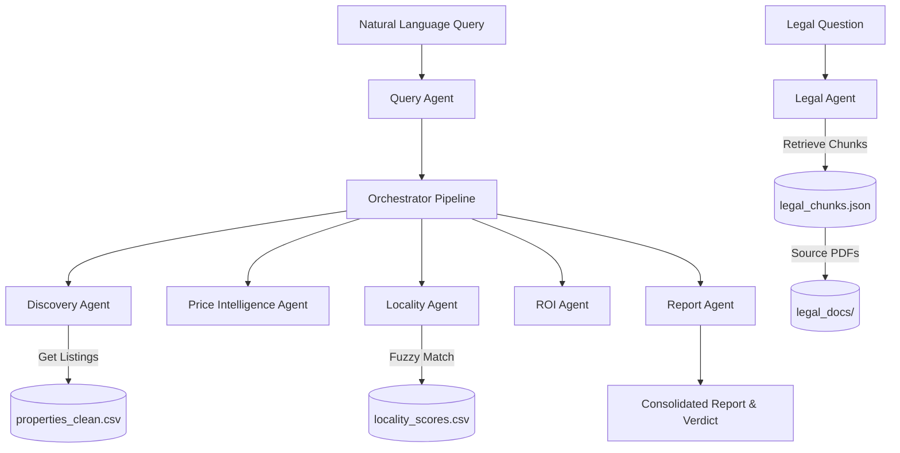

# PropWise AI – Agentic Real Estate Intelligence System

PropWise AI is a modular, agentic intelligence platform designed to streamline real estate property searches, evaluate fair-market valuations, assess local infrastructure connectivity, project financial ROI, and verify legal document compliance. Leveraging cooperative rule-based agents, PropWise AI converts natural language queries into comprehensive investment recommendations.

---

## 📖 Overview

Real estate decisions are complex and require checking listing availability, market prices, local connectivity, financials, and legal regulations.

PropWise AI acts as a multi-agent system where dedicated agents collaborate to:
* **Discover Properties**: Query cleaned property listings based on city, budget, and configuration.
* **Assess Fair Price**: Standardize values and evaluate pricing anomalies against local comparables using IQR-based statistical validation.
* **Analyze Locality Intelligence**: Retrieve neighborhood infrastructure profiles (traffic, schools, hospitals, metro access) using spacing-resilient canonical name-matching.
* **Determine ROI**: Calculate financial feasibility, including rental yields, risk assessments, and expected monthly income.
* **Generate Consolidated Reports**: Aggregate all agent perspectives into a structured, graded investment verdict.
* **Provide Legal Assistance**: Parse and match regulatory legal texts (e.g., RERA PDFs) to address compliance queries.

---

## 🚀 Features

* **Discovery Agent**: Parses user queries to match configuration parameters (BHK, budget caps, city locations) and retrieves relevant records.
* **Price Intelligence Agent**: Filters out pricing outliers, computes local median prices per sqft, and evaluates price deviation scores.
* **Locality Intelligence Agent**: Scores transport connectivity and social amenities with robust sub-locality fallback mappings.
* **ROI Agent**: Computes rental yields and scores investment quality based on structural parameters.
* **Report Agent**: Synthesizes output scores into a final decision (`Strong Buy`, `Consider`, `Avoid`).
* **Legal Agent**: Uses page-aware semantic retrieval, hybrid reranking, and grounded citations to answer questions from regulatory PDFs, with a keyword fallback when the vector index is unavailable.
* **Streamlit Dashboard**: A premium, responsive interface featuring metrics grids, expandable breakdowns, and interactive panels.

---

## 🏗️ Project Architecture



---

## 📊 Datasets

* **`data/properties_clean.csv`**: Contains cleaned and standardized listing data across key cities (Mumbai, Pune, Thane, Kalyan) featuring parameters such as price, size, location, BHK, and price-per-sqft.
* **`data/locality_scores.csv`**: Features structural scoring for connectivity, metro distance, traffic indices, and schools/hospitals in neighborhood cells.
* **`legal_docs/`**: Directory containing raw PDF regulations (e.g. `rera book.pdf`) used to construct RAG indexes in `rag/legal_chunks.json`.

### Phase 1 data layer

The application now reads from an indexed SQLite database at
`data/propwise.db`. It is generated from the committed canonical CSV inputs,
which are never modified by the builder.

Rebuild all Phase 1 assets with:

```bash
python3 scripts/build_phase1_data.py
```

Generated assets:

* **`properties_enriched.csv`**: validated and fingerprint-deduplicated
  listings with price units, amenity counts, readiness flags and a data-quality
  score.
* **`locality_scores_complete.csv`**: complete city/locality coverage with
  `data_source` and `data_confidence` provenance.
* **`propwise.db`**: indexed `properties` and `locality_scores` tables plus the
  joined `property_search` view.
* **`phase1_quality_report.json`**: machine-readable row, duplicate and
  coverage statistics.

Curated locality records have confidence `1.0`. Missing localities receive
same-city median estimates with confidence `0.35`; cities without any curated
record use global medians with confidence `0.20`. These estimates are clearly
labelled in the UI and their scores are pulled toward a neutral 5/10 before
ranking.

The agents use SQLite by default and automatically fall back to the generated
or legacy CSV files if the database is unavailable.

### Phase 2 conversational orchestration

Phase 2 adds a LangGraph supervisor with these nodes:

```text
START → understand → clarify | property | legal | general → END
```

The graph uses an in-memory checkpointer and a unique Streamlit thread ID, so
requirements survive clarification turns. For example:

```text
User: I need a 2 BHK under 80 lakh for investment
Assistant: What city?
User: Pune
Assistant: [continues with the saved BHK, budget and purpose]
```

Groq is optional. Copy `.env.example` to `.env` and add a key if you want
LLM-assisted extraction and summaries:

```text
GROQ_API_KEY=your_key_here
GROQ_MODEL=openai/gpt-oss-20b
```

When configured, Groq Structured Outputs extract typed requirements and Groq
generates a grounded summary from agent results. Without a key, or if the API
fails, the graph automatically uses deterministic extraction and template
responses. Never commit `.env`; it is included in `.gitignore`.

Phase 2 implementation files:

* `agents/phase2_orchestrator.py`: LangGraph state, nodes and routing.
* `agents/llm_service.py`: Groq structured extraction, grounded summaries and
  deterministic fallback.
* `tests/test_phase2.py`: clarification memory and routing tests.

### Phase 3 semantic legal RAG

Phase 3 replaces single-chunk keyword retrieval with page-aware semantic
retrieval while preserving the old legal agent as a fallback:

```text
RERA PDFs → page extraction → overlapping chunks → MiniLM embeddings
→ persistent ChromaDB → hybrid semantic/keyword reranking
→ grounded Groq or extractive answer → page citations
```

Build or rebuild the index:

```bash
python3 build_legal_index.py
```

The builder creates `rag/legal_chunks.json` with `source_file`, `page`,
`page_chunk` and `chunk_id` metadata, and persists vectors under `rag/chroma/`.
Chroma's local `all-MiniLM-L6-v2` embedding model is used; its first run
downloads the model into the user's cache.

At query time, the retriever requests a wider semantic candidate set and
reranks it using semantic similarity plus query-term overlap. The top four
evidence chunks are passed to Groq, which is instructed to answer only from
that evidence and cite `[1]`, `[2]`, and so on. Without Groq, an extractive
answer from the highest-ranked evidence is returned. The UI displays PDF name,
page, chunk ID and similarity for every citation.

Phase 3 implementation files:

* `build_legal_index.py`: page-aware chunk and Chroma index builder.
* `agents/semantic_legal_agent.py`: semantic retrieval, hybrid reranking,
  citations and keyword fallback.
* `tests/test_phase3.py`: vector retrieval, citation and LangGraph integration
  tests.

### Phase 4 financial intelligence

Phase 4 adds a separate versioned ROI scenario model and an advanced financial
calculator. Rebuild the model after rebuilding the Phase 1 database:

```bash
python3 utils/train_roi_model.py
```

The model predicts a proxy annual appreciation rate from locality
infrastructure, rental yield and data confidence. Its target is derived because
this repository has no historical purchase/resale transactions. The model
metadata therefore labels it `derived_proxy_not_historical`; it is for scenario
analysis and must not be presented as a validated market forecast.

For every recommended property, the Financial Scenario Agent calculates:

* down payment, acquisition cost and total upfront cash;
* loan principal and monthly EMI;
* vacancy-adjusted rent, maintenance and net rental yield;
* annual cash flow after EMI and cash-on-cash return;
* remaining loan balance and estimated sale equity;
* conservative, base and optimistic holding-period scenarios;
* future value, net profit, total return and annualized return.

Default assumptions are 20% down payment, 8.5% interest, 20-year loan, 5-year
holding period, 7% acquisition costs, 1% annual maintenance, 5% vacancy, 5%
annual rent growth and 2% selling costs. The user can override key assumptions
inside the query:

```text
2 BHK in Pune under 80 lakh for investment with down payment 25%,
interest 8%, 15 year loan and hold for 7 years
```

All assumptions and limitations are displayed next to the scenario table.

Phase 4 implementation files:

* `utils/train_roi_model.py`: versioned proxy-model training and metadata.
* `agents/financial_agent.py`: EMI, cash-flow and scenario calculations.
* `models/roi_scenario_model.pkl`: trained scenario artifact.
* `models/roi_scenario_model.json`: evaluation and provenance metadata.
* `tests/test_phase4.py`: formula, scenario and orchestration tests.

### Phase 5 production platform foundation

Phase 5 introduces a separate `data/propwise_app.db` application database.
This separation is intentional: rebuilding the property intelligence database
cannot delete accounts, sessions, conversations, favourites or reports.

Application tables:

* `users`: normalized email, display name and password verifier;
* `sessions`: hashed random tokens, expiration and revocation;
* `conversations`: per-user, per-thread chat messages and result payloads;
* `saved_searches`: query and structured requirements;
* `favourites`: unique saved property records per user;
* `reports`: persistent generated recommendation reports.

Passwords use PBKDF2-HMAC-SHA256 with a random 32-byte salt and 310,000
iterations. Plaintext passwords and session tokens are never stored. Guest
mode remains available; persistence features activate after login.

Authenticated users receive:

* persistent messages and property/legal result payloads;
* automatic saved searches and report history;
* favourite-property controls;
* downloadable complete JSON reports;
* revocable seven-day application sessions.

Structured operational events are written as JSON Lines to `logs/app.jsonl`.
Secrets and passwords are never included in these records.

Run locally:

```bash
python3 -m streamlit run app.py
```

Run with Docker Compose:

```bash
docker compose up --build
```

The container exposes port `8501`, persists `data`, `logs` and `reports`, and
uses Streamlit's `/_stcore/health` endpoint for its container health check.
Compose reads values from a local `.env` automatically when present and uses
offline-safe defaults otherwise. Secrets are excluded from the image build
context.

Phase 5 implementation files:

* `agents/app_repository.py`: authentication and persistent user data.
* `agents/app_logging.py`: structured JSON logging.
* `Dockerfile`: reproducible application image and health check.
* `docker-compose.yml`: runtime configuration and persistent volumes.
* `tests/test_phase5.py`: authentication, sessions and persistence tests.

---

## 🛠️ Installation

Clone the repository and install the dependencies:

```bash
pip install -r requirements.txt
```

---

## 💻 Run Application

To launch the Streamlit intelligence panel:

```bash
streamlit run app.py
```

## ✅ Tests

Run the orchestration, legal retrieval, financial calculation, authentication,
and persistence test suites with:

```bash
python3 -m pytest -q
```

The tests use deterministic fallbacks and temporary application databases, so
they do not require a Groq key or modify local user data. Semantic retrieval
tests require the local Chroma index generated by `python3 build_legal_index.py`.

---

## 💬 Sample Queries

### Property Search
* `"Find me a 3 BHK in Mumbai under 1 crore"`
* `"Find me a 2 BHK in Pune under 80 lakh"`

### Legal Assistant
* `"What is RERA?"`
* `"Is it mandatory to register a project?"`

---

## ⚠️ Limitations

* **Manually Curated Localities**: Connectivity and infrastructure scoring rely on a localized dataset mapping 100 primary neighborhoods.
* **Scenario Model**: Appreciation estimates are derived scenario proxies, not forecasts trained on historical resale transactions.
* **Demonstration Data**: Listings and locality attributes are intended for portfolio demonstration and should not be treated as live market data.
* **Local Vector Index**: Semantic legal retrieval requires a locally generated Chroma index; keyword retrieval remains available as an offline fallback.

---

## 🔮 Future Enhancements

* **Live Market Connectors**: Add licensed listing and transaction feeds with refresh and provenance tracking.
* **Model Evaluation**: Validate price and appreciation estimates against time-split historical transactions.
* **Durable Conversation Memory**: Move LangGraph checkpoints from process memory to a persistent store for multi-instance deployments.
